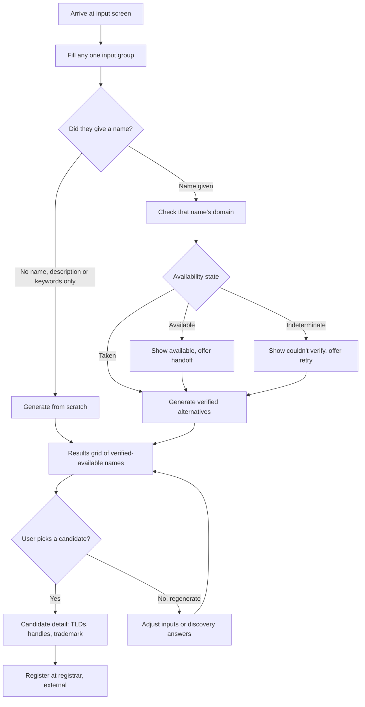
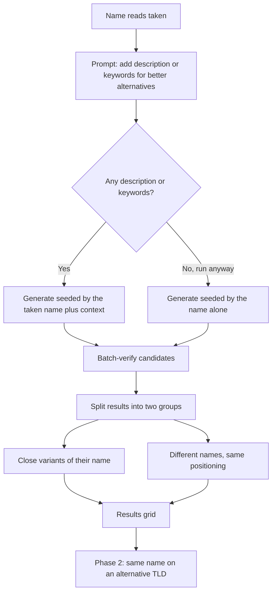
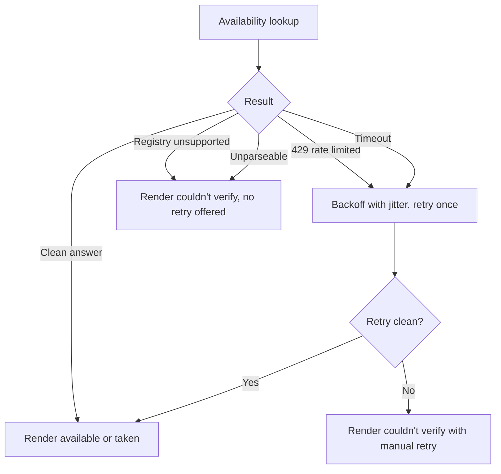

# NameGenius — Flows

Companion to [PRD.md](PRD.md). Read top down: the master flow first, then each branch expanded, then the flows that only exist in later phases.

Every flow states its entry, its steps, its exits, and the edge cases that will actually happen. Where a flow depends on a phase, that's marked.

---

## Level 0 — Master flow

The load-bearing property: **every path converges on the results grid.** A user who arrives with a name they love, a user who arrives with only a paragraph about their startup, and a user whose check failed all end up in the same place, looking at names they can have. There is no dead end where the product says "taken" and stops.

---

## Flow A — Check a name I already have

The impatient path. Someone has a name and wants one bit of information.

**Entry:** input screen, name field.
**Phase:** 1.

1. User types into the name field. Nothing else is required and the primary action is already live.
2. On debounce (roughly 500ms after typing stops), the name is normalized — lowercased, spaces stripped, unicode folded, invalid characters rejected — and `.com` is checked inline.
3. The field's status pill moves through its states: idle, then checking, then one of available, taken, or unverified.
4. If available, the pill turns green and a registrar handoff appears next to it.

**Exits:** available and handed off; taken, which falls into Flow C; unverified, which falls into Flow G.

**Edge cases:**

- Name is under 2 or over 63 characters after normalization: inline validation error, no check fired.
- User keeps typing while a check is in flight: cancel the previous request, don't race the results into the pill.
- Name contains characters that can't exist in a domain (spaces, punctuation, emoji): normalize silently and show the user the normalized domain being checked, so `Acme Coffee Co.` visibly becomes `acmecoffeeco.com` rather than failing mysteriously.
- User pastes a full domain (`acme.com`, `https://acme.com`): strip to the label, don't reject.

---

## Flow B — Generate with no name at all

The blank-page path. Someone knows what they're building and has nothing to call it.

**Entry:** input screen, description or keywords, name field empty.
**Phase:** 1.

1. User writes a description (up to 1,000 characters, with a live counter) and/or adds competitor and keyword chips.
2. Primary action is enabled the moment any one group has content.
3. Optional: user expands the brand-discovery card and answers tone, style, length, and words to avoid. Skipping is free and must feel free.
4. On submit, generation runs: over-generate roughly 5x the intended result count, batch-verify the whole set against the registry, discard everything taken or indeterminate.
5. Results stream into the grid as they verify, rather than appearing all at once at the end.

**Exits:** results grid.

**Edge cases:**

- Description is one word ("app"): generate anyway, but the thinness of the input will show in the results. Don't block; the fix is a nudge to add keywords, not a validation error.
- Description hits the 1,000-character ceiling: counter turns amber before the limit, hard-stops at it.
- Fewer than the target number of candidates survive verification: run a second generation pass automatically before showing a short list. Show a short list rather than padding it with taken names.
- Zero candidates survive two passes: this is a real failure state and needs its own copy — the semantic field is saturated, suggest broadening keywords or accepting an alternative TLD.

---

## Flow C — My name is taken, give me alternatives

The core value path. This is the flow the product exists for.

**Entry:** Flow A returned taken.
**Phase:** 1, with TLD alternatives in 2.

1. The taken verdict is not a wall. Immediately below it, the product offers alternatives and explains that a description will make them better.
2. Generation is seeded by the taken name, so the alternatives are recognizably adjacent to what the user already wanted.
3. Results are split into two labeled groups: close variants of their name, and different names that hit the same positioning. The user's attachment to their original name determines which group they read first, and we don't know which it is, so both are shown.
4. Phase 2 adds a third group: their exact name on an alternative TLD.

**Exits:** results grid, then Flow D.

**Edge cases:**

- Generated candidate is a near-collision with a named competitor: filter it out before display, don't ship a lawsuit.
- Generated candidate is available but is a real trademark of something famous: Phase 2's screening catches this on demand, but the obvious cases should be filtered at generation.
- User's original name is generic ("cloud", "data"): variants will be thin. Weight toward the fresh group.

---

## Flow D — Candidate deep-dive

**Entry:** user selects a candidate card in the results grid.
**Phase:** 1 for the card itself, 2 for the signals.

1. Card expands (or opens a detail panel) showing the name, its availability state and check timestamp, and the one-line rationale for why it was suggested.
2. Signals load independently and progressively, each with its own loading and failure state. None of them blocks the others.
   - **Alternative TLDs** — the same name across the default TLD set, each with its own three-state status.
   - **Social handles** — per platform, each declaring its own confidence. Platforms that can't answer honestly show "not verified," never a guess.
   - **Trademark screen** — on demand, one button, US federal marks only, disclaimer adjacent to the result. Rate limits make this per-name and never per-batch.
3. Primary action on the detail view is the registrar handoff.

**Exits:** registrar handoff (external); back to grid; or Flow F if a signal is Pro-gated.

**Edge cases:**

- The candidate was verified available three minutes ago and is now taken: re-check on detail open. A stale available claim is the one failure that matters most.
- Trademark screen returns many partial matches: rank by similarity and status, cap the list, never summarize as "clear."
- A handle adapter is down: that row shows unavailable-to-check, and the rest of the panel still works.

---

## Flow E — Quota exhaustion

**Entry:** user exceeds free run limit.
**Phase:** 3.

1. Usage is tracked per subject — hashed IP before accounts exist, user id after.
2. As the user approaches the limit, a usage meter appears. No surprises at the wall.
3. On hitting the limit, the run is blocked with copy that says what was hit and when it resets, and offers an account as the way to raise it.
4. Signing in migrates the anonymous session's quota subject to the user id, so a signed-in user doesn't inherit an exhausted IP's counter.

**Exits:** account created and run proceeds; or user waits for reset.

**Edge cases:**

- Shared IP (office, campus, CGNAT) exhausts a whole building's quota: this is why accounts exist by Phase 3, and why the anonymous limit should be generous enough to not bite casual users but tight enough to bound cost.
- User clears cookies to reset quota: the counter is server-side and keyed on hashed IP, so this doesn't work. Verified as a Phase 3 exit criterion.

---

## Flow F — Upgrade to Pro

**Entry:** user hits a Pro-gated signal or wants higher limits.
**Phase:** 4.

1. Gated signals in the candidate detail view render as locked rows that describe what they'd show, rather than being hidden. The user needs to know what they're buying.
2. Upgrade goes to Stripe checkout, styled as the tinted upgrade card from the reference set.
3. On webhook confirmation, the plan lifts and the previously locked signals load in place — the user returns to the exact candidate they were investigating, not to the home screen.

**Exits:** Pro active, gated signals unlocked; or checkout abandoned, gate stays.

**Edge cases:**

- Webhook arrives before the redirect, or after: the UI must tolerate both orders and poll plan state rather than assuming the redirect means paid.
- Webhook replayed: handle idempotently.
- Cancel or downgrade mid-period: gate returns at period end, not immediately.

---

## Flow G — Failure and indeterminate recovery

**Entry:** any availability lookup that doesn't return a clean answer.
**Phase:** 1.

Rules that hold everywhere:

1. Indeterminate never renders as available.
2. Indeterminate candidates never enter the generated results grid — they're silently dropped from the batch, which is why we over-generate.
3. Indeterminate is never cached.
4. Where the registry structurally can't answer (no protocol support), don't offer a retry that will fail identically. Say so and offer a different TLD.

Under sustained load the product degrades toward "couldn't verify," which is honest and recoverable. It must never degrade toward false confidence.

---

## Flow H — Registrar handoff

**Entry:** user has an available name they want.
**Phase:** 1.

1. Handoff opens the registrar in a new tab with the domain prefilled.
2. NameGenius does not register domains and does not take the user's payment for one.
3. NameGenius never registers a name it has suggested. This is both an explicit term of the major availability providers and the fastest possible way to lose an audience.

**Open question carried from the PRD:** one registrar partner or a choice of several. Affiliate revenue argues for one; neutrality argues for a choice.

---

## Flow coverage by phase

| Flow | 1 | 2 | 3 | 4 |
|---|---|---|---|---|
| A — Check a name | Full | | | |
| B — Generate from scratch | Full | | | |
| C — Taken to alternatives | Core | + TLD group | | |
| D — Candidate deep-dive | Card only | + all signals | | |
| E — Quota exhaustion | IP limiting only | | Full | |
| F — Upgrade to Pro | | | | Full |
| G — Failure recovery | Full | | | |
| H — Registrar handoff | Full | | | |

Phase 1 ships flows A, B, C, G, and H complete, which is a coherent product on its own: check a name, learn it's taken, get names you can actually register, and go register one.
