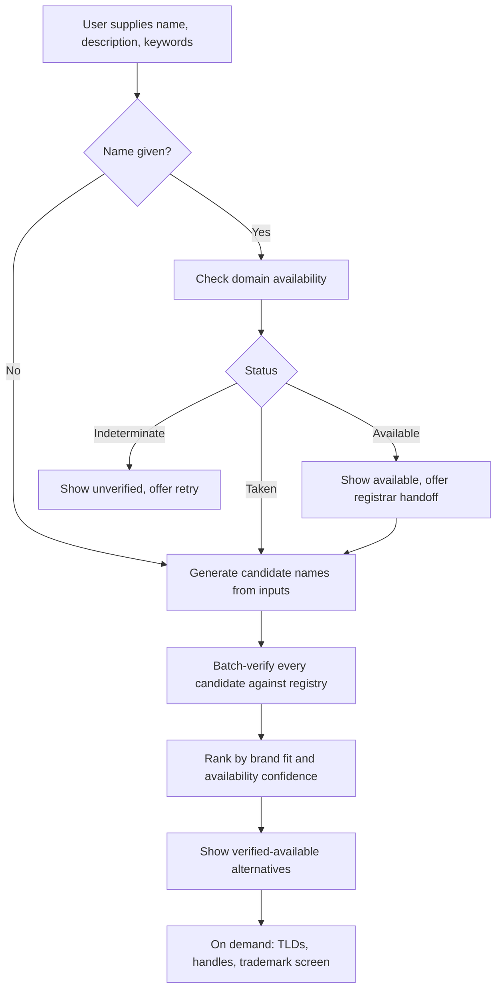

# NameGenius — Product Requirements Document

Status: draft v1
Owner: solo build (agent-assisted)
Last updated: 2026-09-07

---

## 1. Summary

NameGenius helps someone naming a company, product, or project find a name they can actually own.

The user brings a name they are considering. NameGenius tells them whether the domain is free. When it isn't — which is the common case — it suggests alternatives that are both available and on-brand, driven by the user's own description, keywords, and competitors.

The product's whole reason to exist sits in that second half. Domain checkers are commodities and name generators are commodities; the gap is that generators suggest names that are already taken, and checkers tell you "taken" and stop. NameGenius only ever proposes names it has verified are gettable.

## 2. Problem

Someone naming a thing runs the same loop by hand, dozens of times: think of a name, check the domain, find it taken, think of another. Each pass costs a tab switch and yields one bit of information. Existing tools fail in one of two ways.

Domain checkers answer availability but have no idea what the user is building, so their suggestions are mechanical string mangling — prefixes, hyphens, "get" and "try" and "hq", or an obscure TLD nobody will trust.

Name generators produce names that sound good and are almost universally unavailable, because they optimize for linguistic appeal with no knowledge of the registry.

Neither closes the loop. The user still does the cross-referencing.

## 3. Target user

Primary: a founder, indie developer, or product lead naming something they intend to ship, within days not months. They have a rough sense of what they're building and possibly a name they're attached to. They are not a brand strategist and do not want a 40-page naming exercise.

Secondary: agencies and freelancers doing naming for a client, who need to present options that are defensibly available.

Explicitly not the user: enterprise brand teams with trademark counsel and a naming agency on retainer. Their process is slower and more legally rigorous than anything here.

## 4. Jobs to be done

1. "Tell me if the name I already love is available." — fast, unambiguous, no signup.
2. "Give me names that fit what I'm building and that I can actually register." — the core value.
3. "Tell me whether this name is going to get me in trouble." — trademark and existing-company conflicts.
4. "Tell me whether I can be consistent across the internet." — matching social handles.

## 5. Scope

### In scope

- Domain availability check for a name the user types.
- AI-generated alternatives, verified available before being shown.
- Alternative TLD suggestions when a name is taken on `.com`.
- Social handle availability alongside the domain.
- Trademark and existing-company conflict screening.
- Freemium: anonymous free usage, accounts, and a paid Pro tier.

### Out of scope (deliberate, for v1 through v4)

These were considered and cut. Recording them so they don't creep back in without a decision.

- Saved shortlists and favorites.
- Search history across sessions.
- Generated brand assets — logos, colors, taglines.
- Export or share a shortlist as link, PDF, or CSV.
- Bulk check of many pasted candidate names.
- Domain registration or checkout inside NameGenius. We hand off to a registrar.

The cut list has a consequence worth stating plainly: without shortlists or history, a session is ephemeral. The user's output is what they copy out of the screen before they close the tab. Phase 3 introduces accounts for quota reasons, and the moment accounts exist, users will expect saved names. Expect to revisit shortlists at that point rather than treating this cut as permanent.

## 6. Inputs

Three input groups. **Any one of them is enough to run.** All three together produce the best results. This is a hard product rule — the screen must never block on a field the user doesn't want to fill.

| Input | Format | Purpose |
|---|---|---|
| Name | Single line, 1-63 characters, letters/digits/hyphen after normalization | The name to check; also seeds the alternatives |
| Description | Free text, up to 1,000 characters | Semantic grounding for what the name should evoke |
| Competitors and keywords | Chips, up to 10 each | Positioning: what to sound adjacent to, and what to avoid |

Optional brand-discovery questions sharpen results and are presented collapsed, never as a required fifth step. Proposed set, all skippable: tone (playful to serious), name style (invented word, real word, compound, metaphor), length preference, and words or associations to avoid.

If the user supplies only a description, we generate from scratch. If only a name, we treat it as the seed and infer intent from the name itself. If only keywords, we generate from the semantic field.

## 7. Availability semantics (critical)

Availability is not a boolean. The registry data will sometimes not answer, and the single fastest way to destroy trust in this product is to say "available" about a domain the user then fails to register.

Three states, and the UI must distinguish all three:

- **Available** — the authoritative source returned "no such domain."
- **Taken** — the authoritative source returned a registration record.
- **Indeterminate** — the registry doesn't support the protocol, rate-limited us, timed out, or returned something unparseable.

Rules:

1. Never render indeterminate as available. Show it as "couldn't verify" with a retry.
2. Never include an indeterminate candidate in the generated-alternatives list. Suggestions are for verified-available names only.
3. Premium, reserved, and registry-locked domains are technically unregistered but not practically gettable. Where the source signals this, treat it as its own sub-state of available and label it.
4. Availability is a point-in-time claim. Cache it, but stamp every result with when it was checked and expire aggressively.

## 8. Core flow



The generate-then-verify order matters and is the opposite of what's cheap. We over-generate (roughly 4-5x the number of results we intend to show), verify the whole batch in parallel, and discard the taken ones. Verifying first and generating second would mean generating from a whitelist, which produces worse names.

## 9. Ranking

A candidate's score combines two independent signals:

- **Brand fit** — model judgment against the user's description, keywords, and competitor set, returned as a structured score with a short rationale.
- **Availability confidence** — exact `.com` available outranks an alternative TLD, which outranks a longer or modified variant.

Tiebreakers, in order: shorter, pronounceable, no hyphens or digits, no near-collision with a named competitor.

Every shown candidate carries a one-line reason it was suggested. This is not a separate feature — it's the difference between a list of strings and a recommendation, and it costs nothing extra because the generation step already produced it.

## 10. External dependencies and recommendations

### 10.1 Domain availability

Recommendation: **RDAP-first with a commercial fallback.** Build against an internal `AvailabilitySource` interface from day one so the provider is swappable — this is the dependency most likely to change.

| Option | Cost | Coverage | Verdict |
|---|---|---|---|
| Raw RDAP | Free | All gTLDs; ccTLD support is uneven — `.io`, `.nl` good, `.fr`, `.jp` partial, some registries none | **Primary.** Bootstrap from `data.iana.org/rdap/dns.json`, JSON responses, no vendor lock-in. You own bootstrap discovery, per-registry rate limiting, and 429 backoff |
| Fastly Domain Research API | Free tier on published pricing, then per-request | Broad, normalized | **Fallback and burst.** This is where Domainr went — the standalone Domainr API is deprecated. Built for autocomplete-latency search, which fits the batch-verify step. Verify current free-tier volume at integration time |
| Namecheap API | Requires 20 domains, a $50 balance, or $50 recent spend | 400+ TLDs | **No.** Production access is gated behind registrar spend and the API is XML. Wrong shape for a neutral tool |
| DNS-only heuristic | Free, fastest | n/a | **Never as truth.** NXDOMAIN does not mean unregistered — registered-but-unresolving domains read as available and parked domains read as taken. Acceptable only as a pre-filter to reduce RDAP volume, never as a displayed verdict |

Do not register domains NameGenius has suggested. Front-running suggested names is both an explicit violation of the major providers' terms and the fastest possible way to lose the audience.

### 10.2 Name generation

Recommendation: **Vercel AI Gateway with structured output.** One integration, swappable models, no per-provider key management. Generate with `generateObject` against a strict schema so every candidate arrives with its name, style, and rationale already typed — no parsing model prose. Stream results so the user sees candidates appear rather than watching a spinner for the length of a batch.

Cost control is a first-class concern because generation is the only per-run variable cost that scales with abuse. One run should be one generation call producing the full over-generated batch, not one call per candidate.

### 10.3 Trademark screening

Recommendation: **USPTO, free, US-only, framed as screening and never as legal advice.**

The API key is free with a USPTO.gov account and passes in a `USPTO-API-KEY` header. Rate limits are 60 requests per key per minute from 5am to 10pm Eastern, 120 per minute off-peak, with 429 on exceed. That ceiling is low enough that trademark screening cannot run on every candidate in a batch — it runs on demand for a single name the user has chosen to investigate.

One thing to verify before building this phase: TSDR is oriented around status and document retrieval keyed by serial number, while free-text search across mark text lives on the USPTO Open Data Portal. Confirm which endpoint actually supports mark-text search before committing to the phase, because "does anything similar to this name exist" is a search query, not a status lookup.

Scope honestly: US federal marks only, no common-law or state marks, no international registries. Every result needs a visible disclaimer. The failure mode to avoid is a user reading "no conflicts" as clearance.

### 10.4 Social handles

Recommendation: **best-effort, clearly labeled as unverified, and the lowest-priority signal in the product.**

There is no official availability API for handles. GitHub's API answers reliably. X and Instagram do not offer one, and probing profile URLs is rate-limited, ToS-gray, and returns false results against soft-blocked or reserved handles. Build it as a per-platform adapter where each adapter declares its own confidence, show a "not verified" state rather than guessing, and be willing to ship with fewer platforms than the marketing would like.

## 11. Data model

Phase 1 needs only the first three tables. The rest arrive with their phases.

```
runs
  id, session_id, user_id (nullable), name_input, description,
  keywords[], competitors[], discovery_answers (jsonb), created_at

candidates
  id, run_id, name, tld, domain, availability_state,
  availability_source, checked_at, brand_score, rationale

domain_checks            -- cache, keyed by domain
  domain, state, source, checked_at, expires_at

handle_checks            -- cache, keyed by platform + handle
  platform, handle, state, confidence, checked_at, expires_at

trademark_screens
  id, candidate_id, query, hits (jsonb), source, screened_at

users
  id, email, created_at, plan

usage_counters
  subject (user_id or hashed ip), period, runs_used, checks_used
```

Cache TTLs: available results expire fast (minutes) because they're the claim that can hurt us; taken results can live for hours; indeterminate results are not cached at all.

## 12. API surface

| Route | Method | Purpose | Phase |
|---|---|---|---|
| `/api/check` | POST | Single domain status | 1 |
| `/api/generate` | POST | Streamed, verified candidate names | 1 |
| `/api/tlds` | POST | Alternative TLDs for one name | 2 |
| `/api/handles` | POST | Handle availability for one name | 2 |
| `/api/trademark` | POST | Conflict screen for one name | 2 |
| `/api/usage` | GET | Remaining quota for current subject | 3 |
| `/api/checkout` | POST | Stripe session | 4 |
| `/api/webhooks/stripe` | POST | Subscription lifecycle | 4 |

Every route is rate-limited by subject from Phase 1, before any accounts exist, keyed on hashed IP.

## 13. Design

The approved brief for the first screen, carried forward verbatim:

```
Bar: NameGenius — Input & Availability Check (desktop web) — soft card UI on a light
neutral canvas: generously rounded white and pastel-tinted cards, uppercase micro-labels,
monoline icons, one saturated accent per card, pill buttons and badges.
Reference: four screenshots — iOS Profile (grouped rows, uppercase labels, blue CTA),
HopOn ride detail (pill badges, tinted summary card, dark pill button), smart-home
dashboard (card grid, lime accent, black pills, arc gauge), credit-score cards (pastel
tinted cards, arc gauge, segmented bar).
Limits: exactly four input groups — name with inline domain check, description textarea
with ~1000-character counter, competitors and keywords as chip inputs, and one optional
collapsed brand-discovery card — plus a single primary action that enables as soon as any
one group is filled; desktop-only centered card grid at roughly 1120px max width on a
neutral gray canvas, cards white at 24-28px radius with soft elevation and no outline
borders, an 8px spacing scale, semibold headings against gray secondary text, and one
saturated accent per card; every field carries empty, focused, filled, and error states,
the domain check carries idle, checking, available, and taken, and the action carries
disabled, enabled, and loading; no native iOS chrome, no gradients beyond a single soft
tinted card, no emojis, no second accent inside one card; realistic placeholder copy,
never lorem ipsum.
Check: screenshot the built screen at 1440x900 and compare it side by side against the
four references on radius, elevation, spacing rhythm, uppercase label treatment, and
accent discipline; then walk all fifteen listed states, report every difference, and fix
against the reference.
```

Design decisions that extend past the first screen:

- The three availability states map to the reference's pill-badge vocabulary: a green check pill for available, a neutral gray pill for taken, and an amber pill for unverified.
- Status resolves inline on the field, not behind a separate submit. The user should learn whether their name is taken before they ever reach the primary action.
- Results are a card grid, matching the smart-home and credit-score references, one card per candidate carrying the name, its status pill, and its one-line rationale.
- Signal depth (TLDs, handles, trademark) is progressive disclosure on a chosen candidate, not columns in the results grid. Rendering five signals across twenty candidates produces a spreadsheet, and the reference language is cards.

## 14. Phases

Each phase ships something usable and each has an exit criterion that isn't "the code is written."

### Phase 0 — Foundations

Repo, Next.js on Vercel, Postgres, and the design system extracted from the reference set: tokens for the neutral canvas, card radius and elevation, the 8px spacing scale, type ramp, accent colors, and the pill and grouped-row primitives. No product logic.

Exit: the token set and primitives render in isolation and match the references on radius, elevation, and spacing rhythm.

### Phase 1 — Anonymous core loop (MVP)

The input screen from the approved brief, plus `/api/check` and `/api/generate`. RDAP-first availability behind the swappable interface. LLM generation with structured output, over-generated and batch-verified, streamed to a results grid. Three-state availability rendering. Registrar handoff link. Rate limiting by hashed IP. No accounts, no login, no payment.

This is the whole product thesis in one phase: type a name, learn it's taken, get names you can actually have.

Exit: a stranger with no account can go from typing a taken name to a list of verified-available on-brand alternatives in under 15 seconds, and the indeterminate state renders correctly when RDAP is forced to fail.

### Phase 2 — Signal depth

Alternative TLDs for a taken name. Social handles as labeled best-effort with per-platform confidence. USPTO trademark screening on demand for a single chosen name, with disclaimer. All three as progressive disclosure on a candidate card.

Exit: choosing a candidate reveals TLDs, handles, and a trademark screen without any of them being able to claim more confidence than its source justifies.

### Phase 3 — Accounts and quotas

Auth, `users` and `usage_counters`, quota enforcement moved from hashed IP to identity, and a usage meter in the UI. Free tier limits become real and legible.

Exit: quota survives a cleared cookie and a new IP, and a user who hits the limit sees what they hit and when it resets.

Note: this is where the shortlist cut from section 5 will start hurting. Decide there whether to pull it in.

### Phase 4 — Freemium

Stripe checkout, subscription webhooks, plan gating. Proposed line: free gets domain availability and verified alternatives; Pro gets trademark screening, handle checks, extended TLD coverage, and materially higher run limits. The gate sits on the expensive and legally sensitive signals, not on the core loop, so the thing that makes the product worth talking about stays free.

Exit: a full subscribe, gate-lift, cancel, and downgrade cycle works end to end, including the webhook replay case.

### Phase 5 — Hardening and launch

Caching tuned against real traffic, RDAP backoff and per-registry limits under load, abuse controls, cost-per-run instrumentation, error and latency observability, empty and failure states audited, SEO and landing surface.

Exit: cost per run is measured and bounded, and a synthetic traffic spike degrades into indeterminate states rather than into false "available" claims.

## 15. Success metrics

Primary: the share of sessions that end with the user copying or clicking through on at least one available name. That is the product working. Everything else is diagnostic.

Diagnostics:

- Time from first input to first verified-available suggestion.
- Suggestion acceptance rate — of the candidates shown, how many get clicked.
- Indeterminate rate. Rising means the availability layer is degrading.
- Cost per run, split between generation and lookups.
- Free-to-Pro conversion, from Phase 4.

Counter-metric: false-available rate, sampled by re-checking a random slice of names we called available. This should be near zero and is the one number that would justify stopping a launch.

## 16. Risks

| Risk | Consequence | Mitigation |
|---|---|---|
| A name we call available isn't | Trust is gone and doesn't come back | Three-state model, short TTL on available, sampled false-available audit |
| RDAP rate limits under load | Batch verification degrades and results thin out | DNS pre-filter to cut volume, commercial fallback for burst, per-registry limiter, indeterminate rather than guessing |
| Generation cost scales with abuse | Unbounded spend on a free tier | One generation call per run, IP rate limiting from Phase 1, cost per run instrumented before launch |
| Trademark result read as legal clearance | Real harm to a user, real exposure to us | Scope stated in the UI, disclaimer adjacent to results, screening language throughout, never "clear" or "safe" |
| Handle probing breaks or violates ToS | A feature quietly returns garbage | Per-platform adapters with declared confidence, ship only the platforms that answer honestly, unverified state is acceptable |
| Commodity category, hard to be found | Good product, no users | The verified-available guarantee is the only defensible claim; lead with it everywhere |

## 17. Open questions

1. Which USPTO endpoint supports mark-text search rather than serial-number status lookup? Blocks Phase 2 trademark work.
2. Which TLD set is the default? An unbounded list produces noise, and a `.com`-only view is too narrow once a name is taken.
3. Does the registrar handoff go to one partner or offer a choice? Affiliate revenue is possible but conflicts with neutrality.
4. Does the shortlist cut hold through Phase 3, or does auth pull it forward?
